[](code-of-conduct.md)

Colorizer iOS
===============

This is a project for adding color to black-and-white photos and animations. "Colorizer" is a tool that can process black-and-white media and add color to them. The colorizer tool is an app made in Swift and Objective-C++ for iOS devices. It's a rather simple thing to convert color photos to grayscale photos, but to do reverse process needs more sophisticated techniques. In this project, a pre-trained Convolutional-Neural-Network (CNN) model is used to go from grayscale to color photos.

## Background
This project is partly based on the OpenCV example found [here](https://docs.opencv.org/3.4/d6/d39/samples_2dnn_2colorization_8cpp-example.html).

The example is based on a University of Berkeley research project where Zhang et al. trained a CNN model for converting grayscale images to color images. The model was trained using the Caffe framework, which output models the OpenCV framework can handle.

For more information, please visit the research [webpage](http://richzhang.github.io/colorization/) and this Bibtex:

```
@inproceedings{zhang2016colorful,
  title={Colorful Image Colorization},
  author={Zhang, Richard and Isola, Phillip and Efros, Alexei A},
  booktitle={ECCV},
  year={2016}
}
```

A little tweaking of the example code was needed to make it compatible for iOS devices. The user interface is made in Swift and Apple's design tools in Xcode.

## Dependencies
The app cannot run without OpenCV. Luckily, there's a OpenCV module for iOS. However, the module is too large for Git so you need to download it from [here](https://opencv.org/releases/). Download a module of version 3.4.9 or higher. After downloading the package, unzip it and place it insde the Xcode project, see the pictures below.

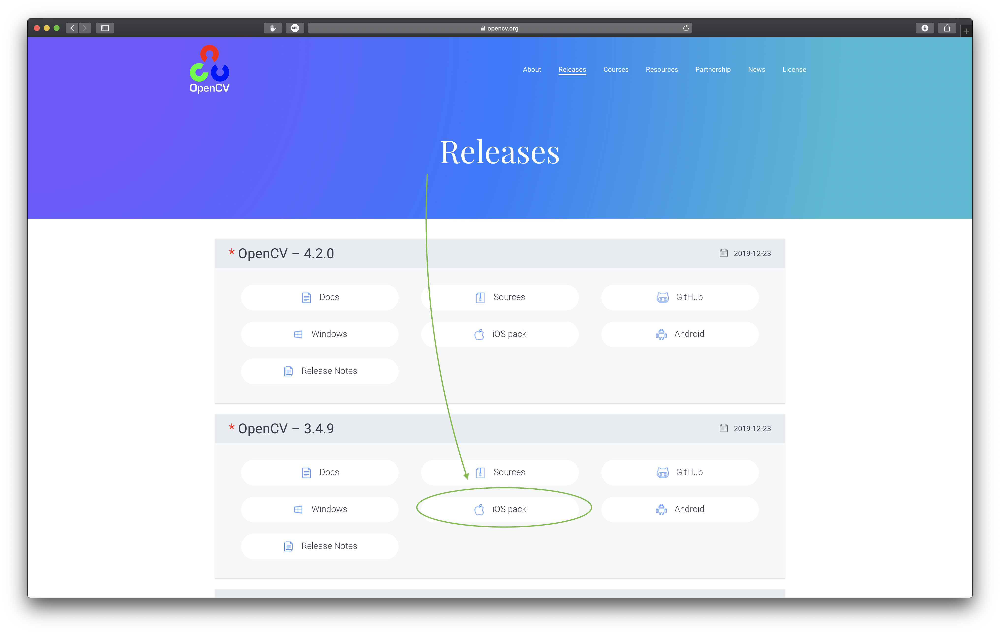

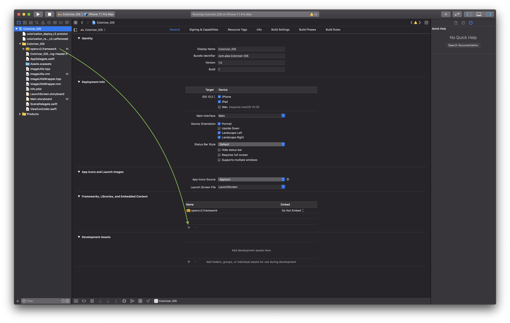

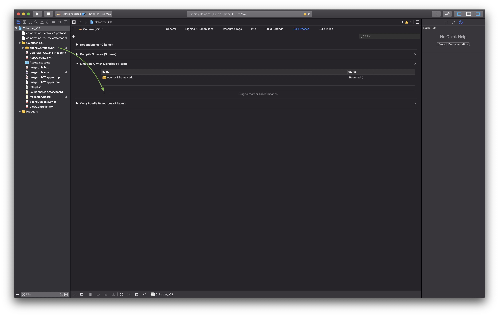

Finally, the Caffe-model files have to be downloaded from [this link](https://www.icloud.com/iclouddrive/0N0bxC_gCVqD4vgyLkAtL-w6Q#models). Unzip the downloaded file and copy `colorization_release_v2.caffemodel` and `colorization_deploy_v2.prototxt` and put them in the root of `Colorizer-iOS` in Xcode, choose "Copy items if needed" and "Add to targets -> Colorizer_iOS". Now, the project should be ready to run.

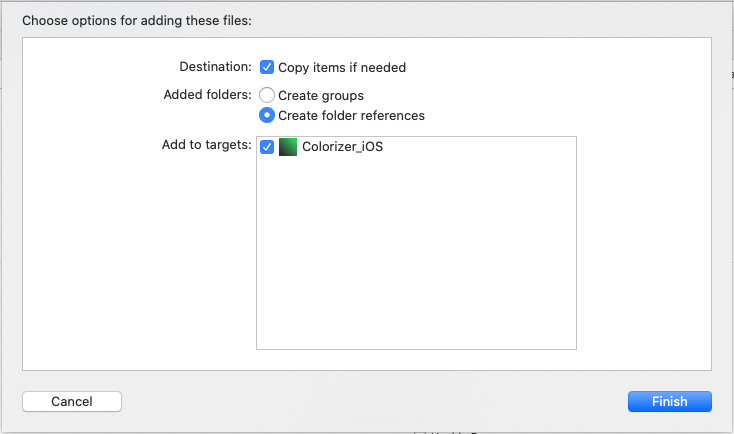

## Interface

### Main interface
Tap on the screen to open the camera roll and choose a photo. The arrow becomes green and the photo can now be colorized. A colorized image will be shown and the share button becomes green, the image can now be saved. To compare the result and the input, there is a segment button go go between these.

<p float="left">
  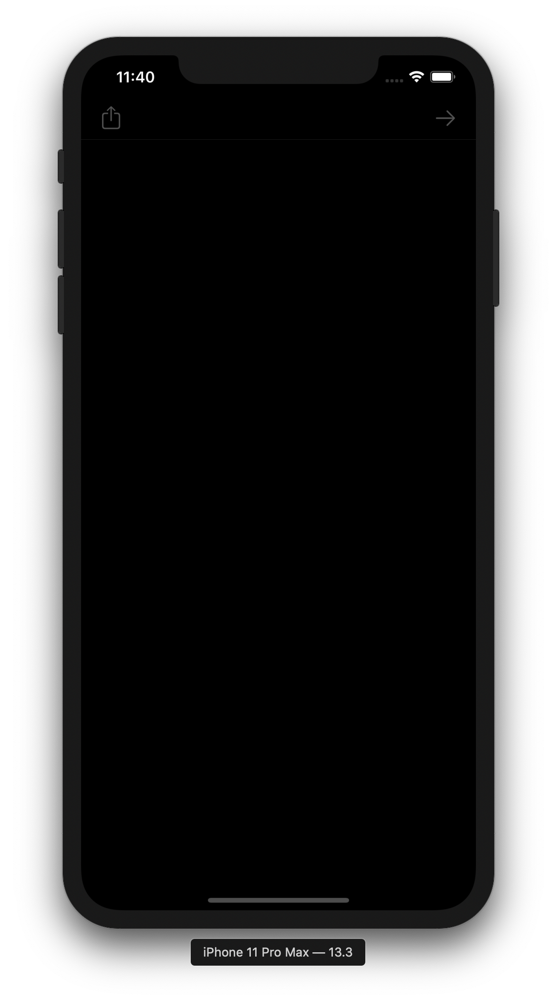
  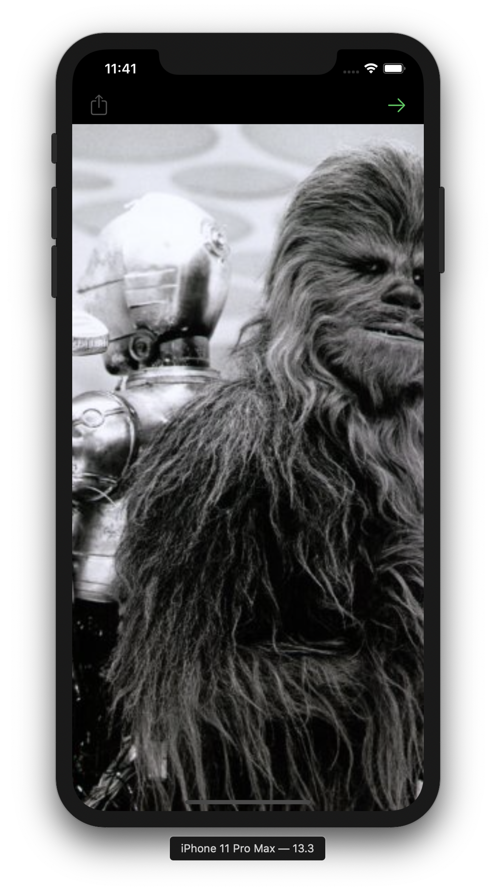 
</p>
<p float="left">
  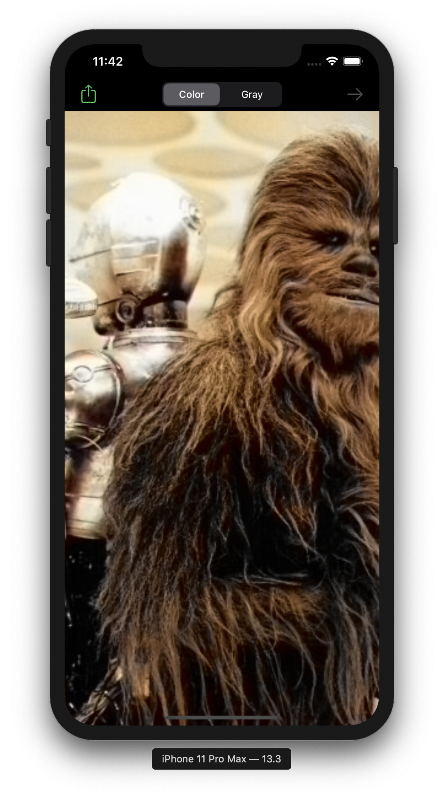 
  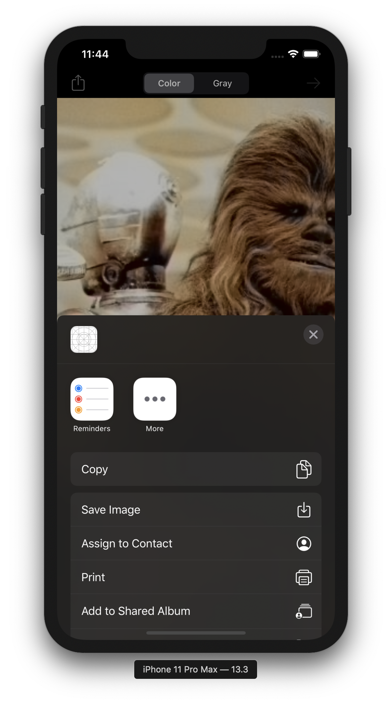 
</p>


## Examples

<p float="left">
  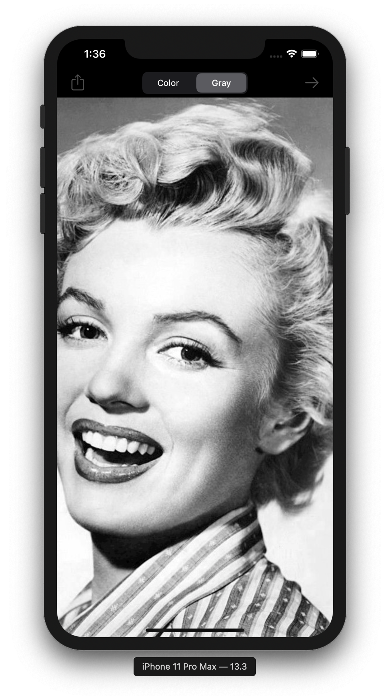
  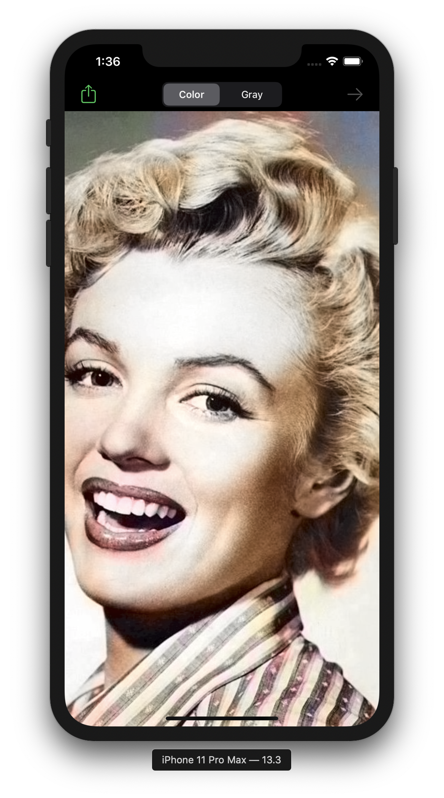 
</p>

<p float="left">
  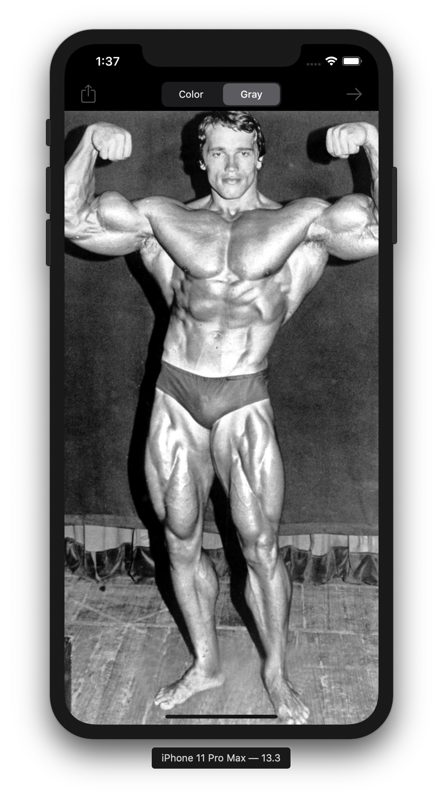
  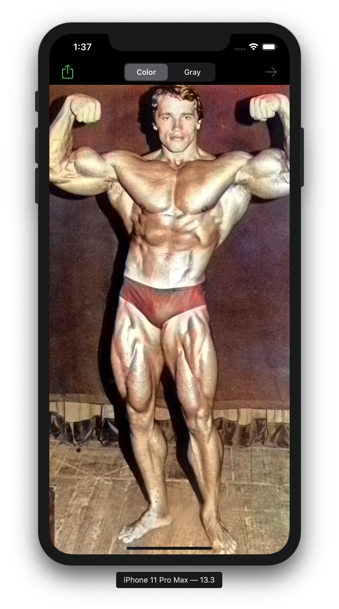 
</p>

<p float="left">
  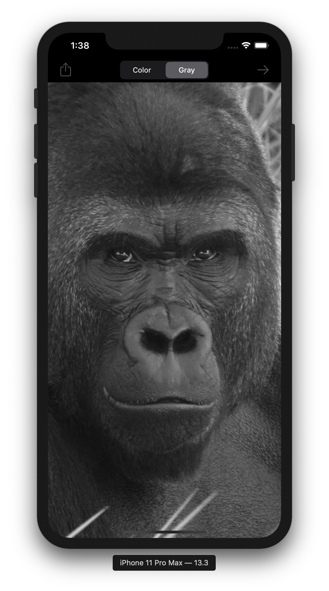
  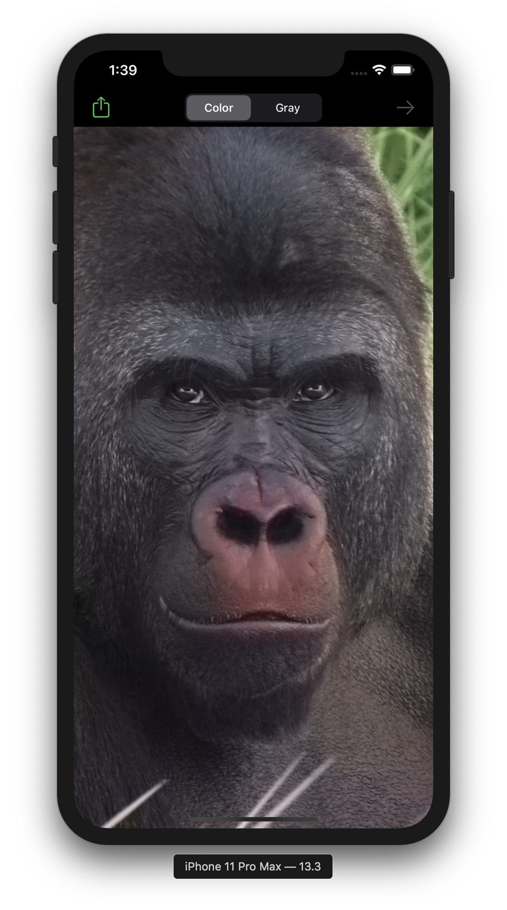 
</p>

<p float="left">
  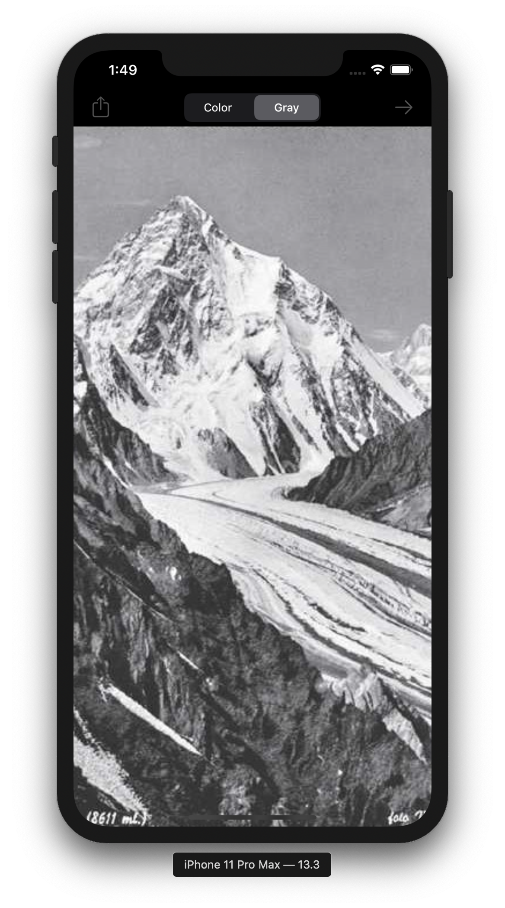
  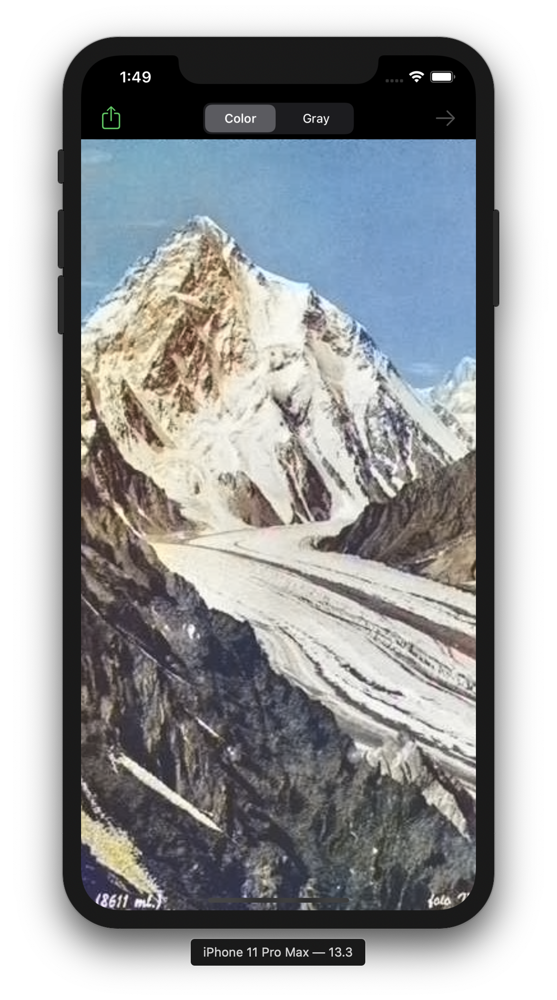 
</p>

## Animations
The app can take black-and-white films and make an animations by sampling images from the movie. Since it takes a long time to convert a batch of grayscale images to color images, it's not recommended to choose too big films. The example below took approximately 17 s. to generate, the orginal film is 13 s long. 52 frames were sampled, which means that every frame takes around 0.33 s to compute when using the Xcode iPhone emulator.

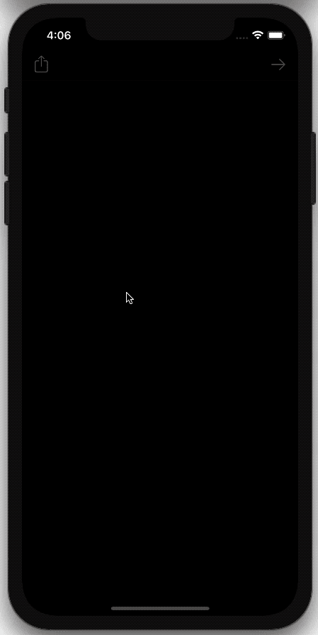

## Future work
* Improve animations.
* Speed up computations to generate animations faster.

## Donations

Paypal


